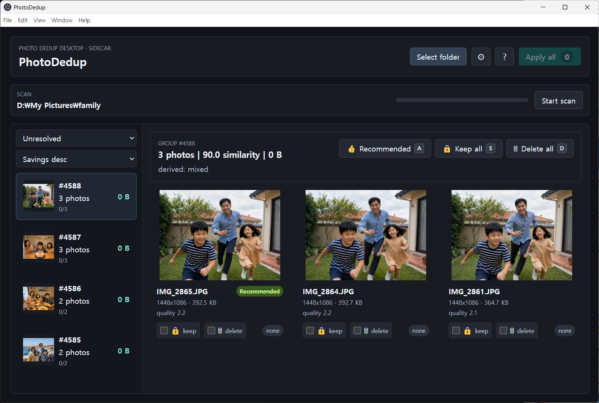

[English](README.md) | [한국어](README.ko.md) | 日本語

# PhotoDedup

PhotoDedupは、重複写真や見た目が似ている写真を見つけて整理するためのデスクトップアプリです。ローカルフォルダーをスキャンし、知覚ハッシュを使用して重複している可能性が高い写真をグループ化し、不要なコピーを隔離フォルダーまたはシステムのゴミ箱へ移動できるようにします。

このアプリはローカルファーストです。写真はお使いのコンピューターにそのまま保存され、スキャンデータはローカルのSQLiteデータベースに保存されます。PhotoDedupが画像やスキャン結果をリモートサービスへアップロードすることはありません。



## 機能

- 知覚ハッシュによる重複写真および類似写真のグループ化
- プラットフォームの画像ライブラリが利用可能な場合のHEIC/HEIF対応
- 解像度、ファイルサイズ、鮮明度、メタデータに基づく保存推奨
- 選択したファイルを隔離フォルダーまたはシステムのゴミ箱へ移動
- 隔離したファイルの復元
- 設定画面でのグループ一覧キャッシュの確認と消去
- 日本語、韓国語、英語のUIラベル
- ElectronデスクトップシェルとローカルのPython FastAPIサイドカー

## インストール

GitHub Releasesから最新のバイナリをダウンロードしてください。

- Windows：インストーラー（`.exe`）またはポータブルビルド
- Linux：AppImage

リリースはこちらで公開しています。

https://github.com/lisyoen/photodedup/releases

## リリース履歴

| バージョン | 日付 | 概要 |
|---------|------|---------|
| v0.1.14 | 2026-08-17 | ディスク上の写真ファイルが変更された場合、再スキャン時に古いサムネイルを自動更新し、表示されるプレビューと重複グループ化の結果が一致するように修正しました。 |
| v0.1.13 | 2026-08-17 | 復旧可能な2段階の隔離移動、中断された処理の起動時復旧、保護された隔離保存先によって写真整理の安全性を強化し、アプリ再開後のトースト通知の期限切れを修正しました。 |
| v0.1.12 | 2026-07-25 | 起動時のスナップショットを返す直前に、現在の完了状態と写真のマークを反映することで、アプリの再起動後に完了済みのグループが再表示される問題を修正しました。 |
| v0.1.11 | 2026-07-25 | 起動時に古いグループが更新前に一時的に表示される問題を修正し、現在のグループを読み込んでいる間の表示を明確にするとともに、クリーンアップ後に起動時のスナップショットを更新するようにしました。 |
| v0.1.10 | 2026-07-25 | 機能変更を含まない検証専用のリリースで、v0.1.9で導入したバックグラウンド自動更新の動作確認を目的として公開しました。 |
| v0.1.4 | 2026-07-18 | 増分スキャンのキャッシュ統計を追加し、新しいファイルが見つからない場合は再グループ化を省略するようにし、ソースインストールの更新に関する修正を最新の状態に保ちました。 |
| v0.1.3 | 2026-07-18 | ソースインストールの更新コマンドが正しいパッケージディレクトリで実行されるように修正しました。 |
| v0.1.2 | 2026-07-18 | 起動時の更新確認、バージョンバッジによるフィードバック、更新フローのテストを追加しました。 |
| v0.1.1 | 2026-07-18 | 公開READMEのローカライズ、スクリーンショット、設定画面のキャッシュ操作、モーダルのレイアウト動作を改善しました。 |
| v0.1.0 | 2026-07-18 | ローカルでの重複写真スキャン、品質に基づく保存推奨、クリーンアップ、復元、多言語UIを備えた最初の公開リリースです。 |

## 開発環境のセットアップ

PhotoDedupは、主に次の3つの部分で構成されています。

- `renderer/`：React + Vite UI
- `shell/`：Electronのメインプロセスとpreloadスクリプト
- `engine/`：Python FastAPIサイドカーと写真処理エンジン

rendererをインストールしてビルドします。

```bash
cd renderer
npm ci
npm run build
```

Electron shellをインストールしてビルドします。

```bash
cd shell
npm ci
npm run build
```

Python engineの環境を作成します。

```bash
cd engine
python3 -m venv .venv
. .venv/bin/activate
pip install -r requirements.txt
```

必要に応じて各プロジェクトのテストを実行します。

```bash
cd renderer && npm test
cd shell && npm test
cd engine && . .venv/bin/activate && pytest
```

## アーキテクチャ

PhotoDedupは、デスクトップウィンドウとプラットフォーム連携を担うElectronシェル、ユーザーインターフェースを担うReact renderer、スキャン、ハッシュ生成、グループ化、サムネイル生成、クリーンアップ計画を担うPython FastAPIサイドカーで構成されています。

Electronプロセスは、一時的なポートとトークンを使用して`127.0.0.1`上でサイドカーを起動します。rendererはpreload bridgeを介して、そのローカルサイドカーとのみ通信します。写真、サムネイル、マニフェストはすべてローカルマシンに保存されます。

## ライセンス

MIT Licenseです。詳しくは[LICENSE](LICENSE)をご覧ください。
