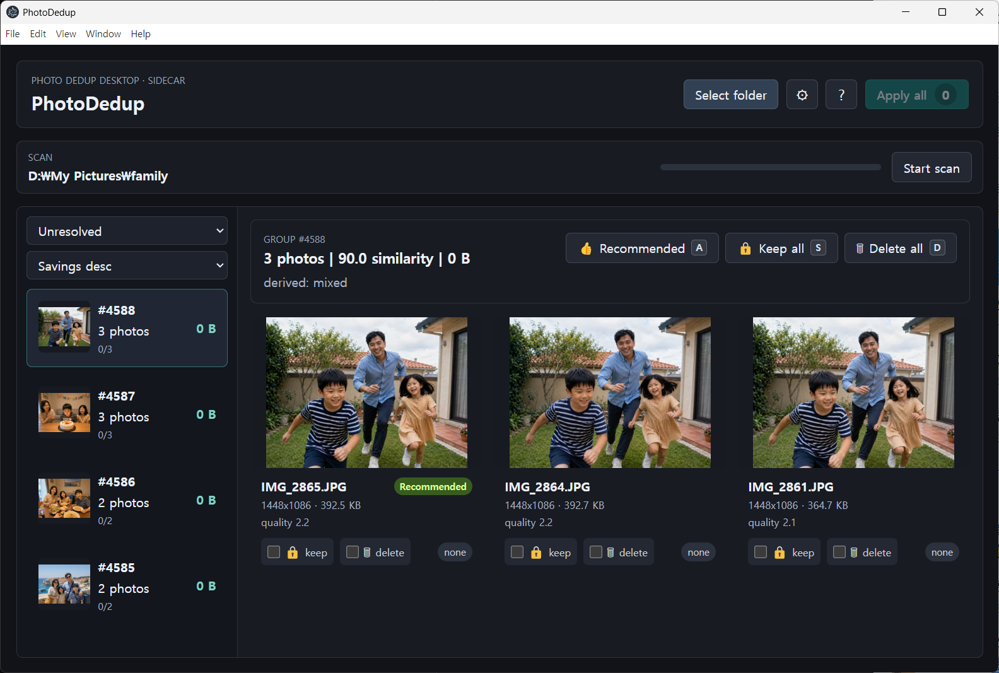

English | [한국어](README.ko.md)

# PhotoDedup

PhotoDedup is a desktop app for finding and cleaning up duplicate or visually similar photos. It scans local folders, groups likely duplicates with perceptual hashes, and helps you move unwanted copies to a quarantine folder or the system trash.

The app is local-first: photos stay on your computer, and scan data is stored in a local SQLite database. PhotoDedup does not upload images or send scan results to a remote service.



## Features

- Perceptual hash grouping for duplicate and near-duplicate photos
- HEIC/HEIF support when the platform image libraries are available
- Quality-based keep suggestions using resolution, file size, sharpness, and metadata
- Move selected files to quarantine or the system trash
- Restore quarantined files
- Inspect and clear the group list cache from Settings
- Korean, English, and Japanese UI labels
- Electron desktop shell with a local Python FastAPI sidecar

## Installation

Download the latest binary from GitHub Releases:

- Windows: installer (`.exe`) or portable build
- Linux: AppImage

Releases are published at:

https://github.com/lisyoen/photodedup/releases

## Release History

| Version | Date | Summary |
|---------|------|---------|
| v0.1.4 | 2026-07-18 | Added incremental scan cache stats, skipped regrouping when no new files are found, and kept source-install update fixes current. |
| v0.1.3 | 2026-07-18 | Fixed source-install update commands to run from the correct package directories. |
| v0.1.2 | 2026-07-18 | Added startup update checks, version badge feedback, and update flow coverage. |
| v0.1.1 | 2026-07-18 | Improved public README localization, screenshots, settings cache controls, and modal layout behavior. |
| v0.1.0 | 2026-07-18 | Initial public release with local duplicate photo scanning, quality suggestions, cleanup, restore, and multilingual UI. |

## Development Setup

PhotoDedup has three main parts:

- `renderer/`: React + Vite UI
- `shell/`: Electron main process and preload scripts
- `engine/`: Python FastAPI sidecar and photo processing engine

Install and build the renderer:

```bash
cd renderer
npm ci
npm run build
```

Install and build the Electron shell:

```bash
cd shell
npm ci
npm run build
```

Create the Python engine environment:

```bash
cd engine
python3 -m venv .venv
. .venv/bin/activate
pip install -r requirements.txt
```

Run tests from each project as needed:

```bash
cd renderer && npm test
cd shell && npm test
cd engine && . .venv/bin/activate && pytest
```

## Architecture

PhotoDedup uses an Electron shell for the desktop window and platform integrations, a React renderer for the user interface, and a Python FastAPI sidecar for scanning, hashing, grouping, thumbnails, and cleanup planning.

The Electron process starts the sidecar on `127.0.0.1` with an ephemeral port and token. The renderer talks only to that local sidecar through the preload bridge. Photos, thumbnails, and manifests remain on the local machine.

## License

MIT License. See [LICENSE](LICENSE).
