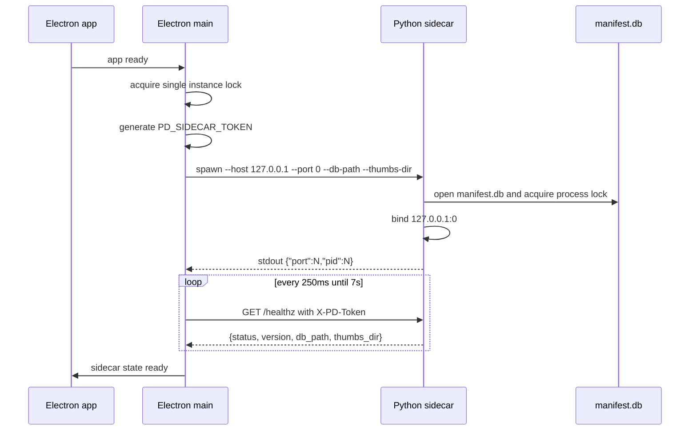
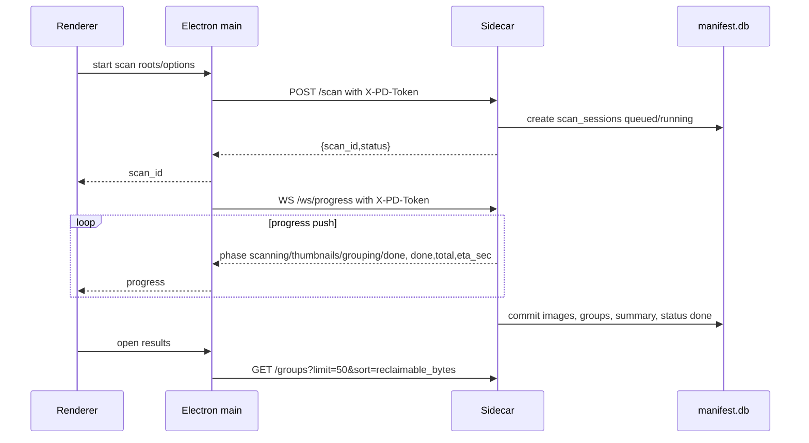
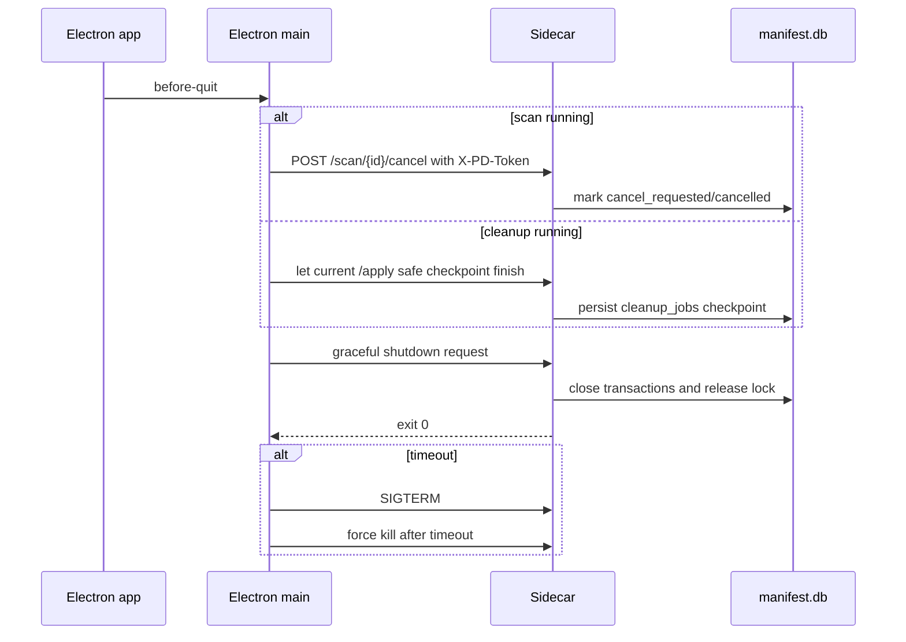
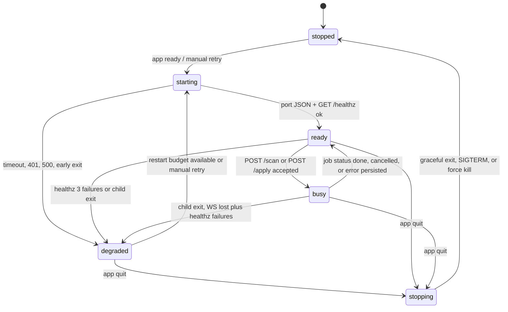

# P0-B Sidecar Lifecycle Contract

대상: Electron main이 기동하고 관리하는 로컬 Python FastAPI 사이드카. 이 문서는 P0-A `api-contract.md`의 `X-PD-Token`, `GET /healthz`, `WS /ws/progress`, REST endpoint, scan phase `scanning`, `thumbnails`, `grouping`, `done`, cleanup phase `planning`, `waiting_for_trash`, `quarantine`, `db_update`, `done`을 그대로 따른다.

## 결정 사항

| 항목 | 결정 | 근거 |
|---|---|---|
| 패키징 | PyInstaller `onedir`로 패키징하고 Windows 산출물은 `resources/sidecar/win32/photodedup-sidecar.exe`와 `_internal/`에 둔다. `electron-builder`는 `extraResources`로 `from: dist/sidecar/win32`, `to: sidecar/win32`를 복사한다. | `onedir`는 수십 MB 파일 묶음을 매 실행 압축 해제하지 않아 콜드스타트 2초 목표에 유리하다. |
| spawn 시점 | Electron main은 앱 기동 직후 단일 인스턴스 락 획득과 앱 데이터 디렉터리 확인을 마친 뒤 사이드카를 즉시 spawn한다. | 시작/폴더 선택 화면부터 `GET /settings`, `GET /healthz`가 필요하므로 첫 스캔까지 지연하면 첫 작업 지연과 오류 표면이 커진다. |
| 실행 인자 | 실행 인자는 `--host 127.0.0.1 --port 0 --db-path <LOCALAPPDATA manifest.db> --thumbs-dir <LOCALAPPDATA thumbs>`만 사용한다. 토큰과 민감 값은 인자로 넘기지 않는다. | 경로와 포트 정책은 진단 가능해야 하지만 토큰은 프로세스 목록에 노출되면 안 된다. |
| 포트 협상 | 사이드카가 `127.0.0.1:0`에 바인딩해 OS 랜덤 포트를 확보하고, stdout 첫 줄에 `{"port":N,"pid":N}` JSON만 출력한다. Electron main은 이 줄을 받은 뒤 `GET /healthz`로 준비 완료를 확인한다. | 실제 리스닝 성공 이후 포트를 통보해야 포트 경합과 TOCTOU를 피한다. |
| 포트 협상 타임아웃 | stdout 포트 통보 대기 3초, 이후 `GET /healthz` 준비 대기 7초로 총 10초를 넘기면 시작 실패로 처리한다. | 정상 `onedir` 시작은 2초 목표이며 10초 초과는 사용자가 조치해야 할 장애로 보는 편이 명확하다. |
| 시작 실패 처리 | 포트 통보 JSON 파싱 실패, timeout, 프로세스 조기 종료, `GET /healthz` 401/500은 사이드카 상태를 `degraded`로 두고 스플래시 또는 오류 배너에서 재시도 버튼을 제공한다. | 앱 창은 진단과 재시도를 제공해야 하며 무한 대기는 피해야 한다. |
| 토큰 생성 | Electron main이 앱 실행마다 crypto secure random 32바이트 이상을 생성하고 같은 실행 동안 모든 REST/WS 요청에 고정 사용한다. | P0-A의 실행 단위 로컬 인증 모델에 맞고 요청마다 바꾸는 방식보다 WS 재연결과 재시도 구현이 단순하다. |
| 토큰 전달 | Electron main은 spawn 환경변수 `PD_SIDECAR_TOKEN`으로 토큰을 전달한다. | 실행 인자는 프로세스 목록과 crash dump에 노출될 수 있으므로 환경변수가 더 좁은 노출면을 가진다. |
| 토큰 검증 | 사이드카는 `/healthz`를 포함한 모든 REST endpoint와 `WS /ws/progress`에서 `X-PD-Token` 헤더를 상수 시간 비교로 검증하고 불일치 시 P0-A error code `unauthorized`의 401을 반환한다. | 인증 규약을 endpoint별 예외 없이 적용해야 renderer 또는 외부 로컬 프로세스의 우회가 없다. |
| 외부 바인딩 금지 | 사이드카는 host 값이 `127.0.0.1`이 아니면 시작을 거부하고, Electron main은 `GET /healthz` 응답 수신 후 반환된 listen host가 loopback인지 확인한다. | 로컬 전용 도구가 LAN 인터페이스를 열면 토큰 유출 시 피해 범위가 커진다. |
| 헬스체크 | 준비 대기 중 250ms 간격, ready 이후 5초 간격으로 `GET /healthz`를 호출한다. 연속 3회 실패하면 `degraded`로 전환한다. | 빠른 기동 감지와 낮은 상시 부하를 동시에 만족한다. |
| 스플래시 표시 | 앱 시작 후 700ms 내 사이드카가 `ready`가 아니면 스플래시를 표시하고, 10초 시작 실패 시 오류 상태로 전환한다. | 정상 빠른 시작에서는 화면 깜박임을 줄이고 느린 시작에서는 사용자가 대기 이유를 알 수 있다. |
| 정상 종료 | 앱 종료 시 `POST /scan/{id}/cancel` 또는 `POST /apply`로 시작된 cleanup 작업 상태에 맞는 취소를 먼저 요청하고 2초 대기, 사이드카에 graceful shutdown 요청 후 3초 대기, 이후 SIGTERM 2초, 마지막으로 강제 kill을 수행한다. | DB 쓰기와 파일 이동 중단 시간을 주되 사용자가 앱 종료에서 오래 묶이지 않게 한다. |
| Electron 크래시 고아 방지 | Windows는 Job Object에 사이드카를 등록해 Electron 프로세스 종료 시 같이 종료되게 하고, 사이드카도 부모 pid 감시 스레드로 2초 간격 생존 확인 후 부모가 사라지면 graceful shutdown한다. | OS 보장과 애플리케이션 감시를 함께 두면 crash와 비정상 kill 양쪽을 줄인다. |
| 크래시 감지 | Electron main은 child `exit`, `error`, `close`, `WS /ws/progress` 끊김, `GET /healthz` 연속 실패를 비정상 종료 신호로 본다. | 프로세스 종료와 네트워크 단절이 항상 같은 순서로 오지 않으므로 여러 신호를 수렴한다. |
| 자동 재기동 | 5분 rolling window에서 최대 3회까지 자동 재기동한다. 초과 시 `degraded`로 고정하고 사용자의 수동 재시도만 허용한다. | 반복 crash loop가 DB와 파일 시스템에 추가 부담을 주지 않게 한다. |
| 진행 중 scan 복구 | scan `queued` 또는 `running` 중 사이드카가 죽으면 해당 `scan_sessions.status`를 `error`, `error_code=internal_error`로 닫고 사용자가 새 `POST /scan`을 시작해야 한다. 이미 커밋된 `images`, `thumbs`, `groups`는 다음 스캔에서 캐시로 재사용한다. | 스캔은 재실행 비용이 낮고 부분 진행률을 억지로 이어가면 `grouping` 일관성이 흔들린다. |
| 진행 중 cleanup 복구 | cleanup `planning` 전이면 `error`로 닫고 재시도한다. `waiting_for_trash`, `quarantine`, `db_update` 중이면 시작 시 `cleanup_jobs`와 `quarantine`/`trash_history`를 대조해 완료 여부를 검증한 뒤 누락 DB 반영만 보정하고, 파일 이동을 임의 재실행하지 않는다. | 삭제/이동은 비가역성이 있어 재시작 시 중복 실행보다 보수적 검증이 안전하다. |
| DB 일관성 | 사이드카는 `scan_sessions`, `cleanup_jobs`, `images.mark`, `images.is_quarantined`, `images.trashed_at` 변경을 SQLite transaction으로 묶고 job status를 마지막에 갱신한다. 그룹 헤더 선택 상태는 `images.mark`에서 파생하며 그룹 컬럼으로 저장하지 않는다. | P0-A/P0-C와 DB diff의 상태 컬럼이 화면 복구의 단일 근거가 되어야 한다. |
| 동시 실행 방지 | Electron main은 앱 시작 즉시 single instance lock을 획득하지 못하면 기존 인스턴스를 foreground로 올리고 종료한다. 사이드카는 추가로 manifest.db에 process lock을 잡고 실패 시 409 `conflict`로 시작 실패한다. | 두 앱이 같은 `%LOCALAPPDATA%\PhotoDedupDesktop\manifest.db`를 쓰면 잠금 충돌과 상태 오염이 발생한다. |
| 로그 위치 | Electron main은 사이드카 stdout/stderr를 `%LOCALAPPDATA%\PhotoDedupDesktop\logs\sidecar-YYYYMMDD.log`에 저장하고 main 로그는 같은 폴더의 `main-YYYYMMDD.log`에 저장한다. | 사용자가 보낼 수 있는 단일 로그 위치가 있어야 장애 대응이 가능하다. |
| 로그 로테이션 | 로그는 날짜별 파일, 파일당 10MB 초과 시 `.1`, `.2`로 회전하고 최근 14일 또는 총 200MB 중 먼저 도달한 기준으로 삭제한다. | 디버깅에 충분한 기간을 남기면서 앱 데이터 폴더 비대를 제한한다. |

## 기동 시퀀스



## 스캔 실행 시퀀스



## 앱 종료 시퀀스



## 사이드카 크래시 복구 시퀀스

```mermaid
sequenceDiagram
    participant Renderer
    participant Main as Electron main
    participant Sidecar
    participant DB as manifest.db
    Sidecar--xMain: child exit or healthz failures
    Main-->>Renderer: sidecar state degraded
    Main->>Main: check restart budget max 3 per 5m
    alt restart allowed
        Main->>Sidecar: spawn new sidecar with same token
        Sidecar->>DB: inspect scan_sessions and cleanup_jobs
        Sidecar->>DB: close unsafe running scan as error; reconcile cleanup checkpoint
        Sidecar-->>Main: stdout {"port":N,"pid":N}
        Main->>Sidecar: GET /healthz with X-PD-Token
        Main-->>Renderer: sidecar state ready, require REST refresh
    else restart denied
        Main-->>Renderer: persistent degraded error and manual retry
    end
```

## 상태 머신



| 현재 | 이벤트 | 다음 | 동작 |
|---|---|---|---|
| `stopped` | 앱 시작, 단일 인스턴스 락 획득 | `starting` | 토큰 생성, 사이드카 spawn, stdout 포트 대기 |
| `starting` | `{"port":N,"pid":N}` 수신과 `GET /healthz` 성공 | `ready` | renderer에 API 사용 가능 통보 |
| `starting` | 10초 timeout 또는 조기 종료 | `degraded` | 로그 기록, 재시도 UI 표시 |
| `ready` | `POST /scan` 또는 `POST /apply` 202/200 수락 | `busy` | `WS /ws/progress` 연결, 진행 상태 전달 |
| `busy` | job status `done`, `cancelled`, `error` | `ready` | REST 재조회로 화면 갱신 |
| `ready` | healthz 3회 실패 또는 child exit | `degraded` | 자동 재기동 예산 확인 |
| `busy` | child exit 또는 WS 끊김 후 healthz 실패 | `degraded` | 진행 job 안전 중단/보정 후 재기동 |
| `degraded` | 재기동 예산 남음 또는 수동 재시도 | `starting` | 새 프로세스 spawn, DB 복구 검사 |
| `ready`/`busy`/`degraded` | 앱 종료 | `stopping` | cancel, graceful shutdown, SIGTERM, kill 순서 적용 |
| `stopping` | 프로세스 종료 확인 | `stopped` | 로그 flush, lock 해제 |
