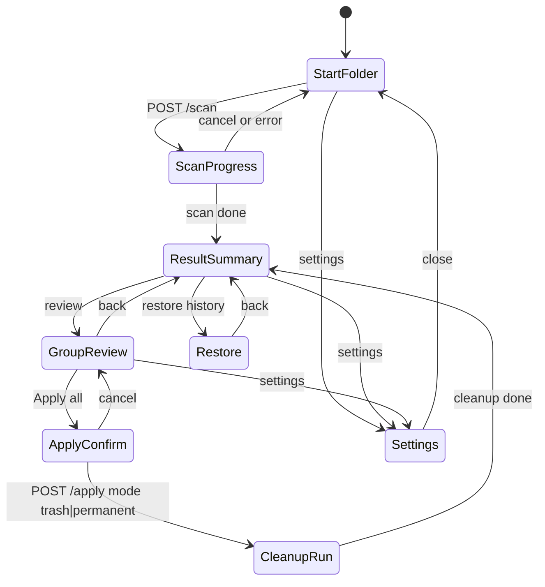

# P0-C UI Flow Wireframes

대상: 기획서 F1~F4를 P0-A/P0-C API로 연결하는 사용자 화면 흐름. 모든 호출은 Electron main을 경유하며 main은 `X-PD-Token`을 붙여 사이드카 REST endpoint와 `WS /ws/progress`에 접근한다. P0-C는 P0-B의 "keep 토글 변경 -> 추천 적용 자동 체크 + POST action" UX 절을 대체한다. 선택 상태의 단일 진실은 사진별 `mark`이며 그룹 체크 상태는 저장하지 않고 사진 `mark`에서 파생한다.

## 화면 전이도



## 1. 시작/폴더 선택

```text
+------------------------------------------------------------+
| Photo Dedup Desktop                              [Settings] |
+------------------------------------------------------------+
| Recent scans                                                |
|  2026-07-12  D:\Photos, E:\Camera     1,240 files [Open]   |
|  2026-07-10  C:\Users\me\Pictures       312 files [Open]   |
+------------------------------------------------------------+
| Folders                                                    |
|  [D:\Photos                                      ] [Remove] |
|  [E:\Camera                                      ] [Remove] |
|  [+ Add folder]                                            |
+------------------------------------------------------------+
| Options                                                    |
|  [x] Include subfolders                                    |
|  Extensions  [jpg,jpeg,png,heic,webp              ]        |
|  Similarity threshold  90  [----------|------]             |
+------------------------------------------------------------+
|                                      [Start scan]           |
+------------------------------------------------------------+
```

호출 API: 진입 시 `GET /settings`, 스캔 시작은 `POST /scan` `{roots, recursive, extensions, threshold}`. 최근 이력은 `GET /groups`와 `scan_sessions` summary를 읽는 앱 내부 요약 캐시로 표시한다.

상태/에러 처리: 사이드카 `degraded`면 폴더 입력은 가능하지만 `[Start scan]`은 비활성화하고 `GET /healthz` 재시도 상태를 표시한다. 권한 없는 폴더는 `POST /scan`의 400 `invalid_request` 또는 422 `unsafe_path`를 root 행에 붙인다.

## 2. 스캔 진행

```text
+------------------------------------------------------------+
| Scanning D:\Photos, E:\Camera                    [Cancel]   |
+------------------------------------------------------------+
| phase: scanning                                            |
| [###############-------------------------] 38%              |
| 420 / 1,100 items                         ETA 32 sec        |
|                                                            |
| scanning    [###############-----]                         |
| thumbnails  [--------------------]                         |
| grouping    [--------------------]                         |
| done         [--------------------]                         |
+------------------------------------------------------------+
| Current: D:\Photos\2024\IMG_0420.HEIC                      |
+------------------------------------------------------------+
```

호출 API: 시작 직후 `GET /scan/{id}`로 baseline을 받고 `WS /ws/progress`를 구독한다. 취소는 `POST /scan/{id}/cancel`. WS가 끊기면 `GET /scan/{id}`를 즉시 호출하고 재연결 전까지 2초 간격 polling을 수행한다.

## 3. 결과 요약

```text
+------------------------------------------------------------+
| Scan complete                                               |
+----------------------+----------------------+--------------+
| Duplicate groups     | Candidate photos     | Est. savings |
| 128                  | 392                  | 8.4 GB       |
+----------------------+----------------------+--------------+
| Top filters: [Unresolved 128] [Large groups 12] [HEIC 31]  |
+------------------------------------------------------------+
| [Review groups]                         [Run cleanup later] |
+------------------------------------------------------------+
```

호출 API: `GET /scan/{id}`의 `summary`를 우선 표시하고, 상세 집계는 `GET /groups?limit=50&sort=reclaimable_bytes`의 `total_estimate`, `items.reclaimable_bytes`, group image count로 보정한다.

## 4. 그룹 리뷰

```text
+--------------------------------------------------------------------------------+
| Filters [Unresolved v] [size >= 2 v] [similarity >= 90] Sort [savings desc v]   |
+-----------------------------+--------------------------------------------------+
| Groups                      | Group #184  5 photos  96.2 similarity  420 MB    |
| [#184] 5 photos 420 MB      | [👍 Recommended] [🔒 Keep all] [🗑 Delete all] |
| [#181] 3 photos 210 MB      | derived: mixed                                  |
| [#170] 2 photos 188 MB      |                                                  |
| ... virtual scroll ...      | +------------+ +------------+ +------------+     |
| cursor: next_cursor         | | photo A    | | photo B    | | photo C    |     |
|                             | | score 91   | | score 84   | | score 76   |     |
|                             | | [🔒 x] [🗑 ]| | [🔒 ] [🗑 ]| | [🔒 ] [🗑 ]|     |
|                             | | mark keep  | | mark none  | | mark none  |     |
|                             | +------------+ +------------+ +------------+     |
|                             |                                                  |
|                             | Assistant [Best quality] [Newest] [Original]     |
|                             | Preview: keep photo A, delete 4, save 420 MB    |
|                             | [Open compare]                    [Apply all]   |
+-----------------------------+--------------------------------------------------+
```

구성 요소: 그룹 카드 목록, 가상 스크롤, cursor pagination, 필터, 정렬, 그룹 상세, 사진 카드, 사진별 자물쇠/휴지통 체크박스, 그룹 헤더 3버튼, Selection Assistant, 비교 뷰 진입, 내비게이션 `[Apply all]`.

호출 API: 그룹 목록은 `GET /groups?limit=50&cursor=<cursor>&sort=<sort>&status=<status>&min_size=<n>&max_size=<n>&min_similarity=<n>`를 사용한다. 그룹 상세는 `GET /groups/{id}`. 사진 마크 변경은 `PATCH /images/{id}` `{mark:"keep"|"delete"|"none"}`. 그룹 단위 3액션은 `POST /groups/{id}/action` `{action:"apply_recommended"|"keep_all"|"delete_all"}`. 썸네일은 `GET /thumbs/{image_id}`.

초기값: 그룹 생성 파이프라인은 유지한다. 그룹 생성 직후 추천 사진은 `mark="keep"`, 나머지 사진은 `mark="none"`으로 둔다. 추천 사진 판단에는 기존 `recommended_keep`/`recommended_keep_image_id` 산출 규칙을 사용한다.

사진 카드 체크박스: 각 사진에는 자물쇠 keep, 휴지통 delete 체크박스 2개를 표시한다. 두 체크박스는 상호배타다. 자물쇠를 켜면 `mark="keep"`, 휴지통을 켜면 `mark="delete"`, 켜진 체크를 다시 해제하면 `mark="none"`이다. 둘 다 체크된 상태는 UI와 API 양쪽에서 허용하지 않는다.

그룹 헤더 3버튼: `👍 Recommended`는 추천 사진 `keep` + 나머지 `delete`, `🔒 Keep all`은 모든 사진 `keep`, `🗑 Delete all`은 모든 사진 `delete`로 그룹 내 사진 `mark`를 일괄 갱신한다. 세 버튼은 상호배타로 표시되지만 저장되는 그룹 상태는 없다.

파생 상태: 그룹 버튼 체크 여부는 현재 사진 `mark` 집합에서만 계산한다. 세 패턴 중 하나와 정확히 일치하면 해당 버튼만 체크로 표시한다. 어느 패턴과도 일치하지 않으면 혼합 상태이며 세 버튼은 모두 해제된다. 사용자가 개별 사진을 변경해 패턴을 이탈하면 그룹 버튼은 즉시 자동 해제된다.

Selection Assistant: 규칙은 최고 화질만 유지, 최신만 유지, 원본 우선, 최대 해상도 우선, 파일명 패턴 우선으로 고정한다. 사용자가 규칙을 누르면 클라이언트가 현재 `GET /groups/{id}` 응답의 `quality_score`, `width`, `height`, `size_bytes`, `taken_at`, `format`, path를 기준으로 미리보기를 만들고 API 호출은 하지 않는다. `[Apply preview]`에서 선택 결과를 사진별 `PATCH /images/{id}` `{mark}`로 반영한다.

필터: 미처리/처리됨은 사진 `mark`에서 파생한 그룹 상태를 기준으로 한다. 그룹 크기는 `min_size`/`max_size`, 유사도는 `min_similarity`를 사용한다. 정렬은 `created_at`, `group_size`, `reclaimable_bytes`, `similarity`, `quality` 중 하나를 사용하고 기본은 `reclaimable_bytes desc`.

### 선택 상태 전이표

| 이벤트 | API | 사진 `mark` 변경 | 그룹 체크 파생 |
|---|---|---|---|
| 사진 keep 체크 켬 | `PATCH /images/{id}` `{mark:"keep"}` | 해당 사진만 `keep` | 성공 응답 후 전체 사진 `mark`로 3패턴 재계산 |
| 사진 delete 체크 켬 | `PATCH /images/{id}` `{mark:"delete"}` | 해당 사진만 `delete` | 성공 응답 후 전체 사진 `mark`로 3패턴 재계산 |
| 사진 체크 해제 | `PATCH /images/{id}` `{mark:"none"}` | 해당 사진만 `none` | 보통 혼합 상태가 되어 그룹 버튼 모두 해제 |
| 그룹 `👍 Recommended` 체크 | `POST /groups/{id}/action` `{action:"apply_recommended"}` | 추천 사진 `keep`, 나머지 `delete` | 응답 이미지 목록이 정확히 추천 패턴이면 `👍` 체크 |
| 그룹 `🔒 Keep all` 체크 | `POST /groups/{id}/action` `{action:"keep_all"}` | 모든 사진 `keep` | 응답 이미지 목록이 전부 `keep`이면 `🔒` 체크 |
| 그룹 `🗑 Delete all` 체크 | `POST /groups/{id}/action` `{action:"delete_all"}` | 모든 사진 `delete` | 응답 이미지 목록이 전부 `delete`이면 `🗑` 체크 |
| 개별 변경으로 패턴 이탈 | 위 사진 PATCH 중 하나 | 일부 `keep`/`delete`/`none` 혼합 | 세 그룹 버튼 모두 해제 |

실패 처리: PATCH 실패 시 해당 사진 체크를 원복한다. 그룹 action 실패 시 그룹 전체 `GET /groups/{id}`를 재조회해 서버 상태로 복원하고 오류 toast를 표시한다. 그룹 버튼은 별도 저장하지 않으므로 실패 후에도 사진 `mark` 응답만 신뢰한다.

### 비교 뷰

```text
+--------------------------------------------------------------------------------+
| Compare group #184                                      [1:1] [Fit] [Close]     |
+--------------------------------------------------------------------------------+
| +----------------------+ +----------------------+ +----------------------+       |
| | zoomed photo A       | | zoomed photo B       | | zoomed photo C       |       |
| +----------------------+ +----------------------+ +----------------------+       |
| score 91  4032x3024    | score 84  4032x3024    | score 76  1920x1440          |
| 3.8 MB  2024-05-01     | 4.1 MB  2024-04-30     | 1.2 MB  2022-08-11           |
| [🔒 x] [🗑 ] mark keep | [🔒 ] [🗑 x] mark del  | [🔒 ] [🗑 ] mark none       |
+--------------------------------------------------------------------------------+
| <-/-> move   K keep   D delete   U none   A recommended   esc close            |
+--------------------------------------------------------------------------------+
```

호출 API: 진입 시 `GET /groups/{id}`와 각 `GET /thumbs/{image_id}`를 사용한다. 마크 변경은 리뷰 화면과 같은 `PATCH /images/{id}` `{mark}` 후 그룹 체크 파생 상태를 재계산한다.

## 5. 전체 적용 확인

```text
+------------------------------------------------------------+
| Apply all marked deletes                                    |
+------------------------------------------------------------+
| Delete-marked photos   264                                  |
| Groups affected        112                                  |
| Estimated savings      8.4 GB                               |
|                                                            |
| Mode                                                       |
|  (o) Move to Windows Recycle Bin                            |
|  ( ) Permanently delete                                     |
|                                                            |
| Keep and undecided photos will not be changed.              |
+------------------------------------------------------------+
| [Cancel]                                      [Apply all]   |
+------------------------------------------------------------+
```

진입: 그룹 리뷰 내비게이션의 `[Apply all]` 버튼으로 열린다. 대상은 모든 그룹의 `mark="delete"` 사진이다. `keep`과 `none` 사진은 파일 시스템을 변경하지 않으며, `none`은 다음 스캔에도 그대로 유지된다.

호출 API: 확인 버튼은 `POST /apply` `{mode:"trash"|"permanent"}`를 호출한다. 기본값은 `trash`이며 Windows 휴지통 이동은 Electron main의 `shell.trashItem`에 위임한다. 응답은 202 `{job_id,status,targets}`이며 진행은 `WS /ws/progress` 또는 `GET /cleanup/{id}`로 표시한다.

## 6. 정리 실행

```text
+------------------------------------------------------------+
| Applying delete marks                                       |
+------------------------------------------------------------+
| cleanup phase: waiting_for_trash                            |
| [########----------------------------] 24%  64 / 264        |
+------------------------------------------------------------+
| Complete: 260 done, 4 failed, 8.1 GB reclaimed [Report]     |
+------------------------------------------------------------+
```

상태/에러 처리: `trash` 기본 모드는 Electron main의 `shell.trashItem` 실행 구간 때문에 phase `waiting_for_trash`를 표시한다. `permanent`는 휴지통을 거치지 않고 사이드카의 대상 검증, 파일 삭제, DB 반영 순서로 진행한다. 422 `unsafe_path`는 경로별 경고 목록을 열고 실행을 차단한다.

## 7. 복원

```text
+------------------------------------------------------------+
| Restore quarantined photos                                  |
+------------------------------------------------------------+
| [ ] IMG_0420.HEIC  D:\Photos\2024\IMG_0420.HEIC   3.8 MB   |
| [ ] IMG_0418.HEIC  D:\Photos\2024\IMG_0418.HEIC   4.1 MB   |
+------------------------------------------------------------+
| [Select all]                              [Restore selected]|
+------------------------------------------------------------+
```

호출 API: 격리 목록은 P1에서 read endpoint가 필요하다. 실행 API는 `POST /restore` `{quarantine_ids, restore_all}`이며 응답 `{restored, failed}`를 표시한다. 휴지통 또는 완전 삭제 모드로 정리한 항목은 이 화면에서 앱 내부 복원이 불가능하다.

## 8. Settings

```text
+------------------------------------------------------------+
| Settings                                                    |
+------------------------------------------------------------+
| Language                                                   |
|  (o) English (default)                                     |
|  ( ) 한국어                                                |
+------------------------------------------------------------+
| Scan Folders                                               |
|  [D:\Photos                                      ] [Add]    |
|  D:\Photos                                      [Remove]   |
|  E:\Camera                                      [Remove]   |
+------------------------------------------------------------+
| Settings are saved immediately.                            |
+------------------------------------------------------------+
|                                               [Close]      |
+------------------------------------------------------------+
```

진입: 헤더 우측 톱니바퀴 아이콘 버튼에서 오버레이 설정 모달을 연다. 설정 변경은 즉시 적용하고 즉시 저장하므로 별도 Save 버튼은 두지 않는다. 하단 `[Close]`는 모달만 닫는다.

Language: `English (default)`, `한국어`, `日本語` 중 하나를 라디오 또는 셀렉트로 선택한다. 언어 선택지의 언어명은 현재 UI 언어와 무관하게 각 언어의 네이티브 표기(`English`/`한국어`/`日本語`)로 고정하고, 기본 언어는 명시적으로 `en`이며 시스템 언어 자동감지는 하지 않는다. 변경 즉시 전체 UI 문자열을 전환하고 `localStorage` 키 `pdd.settings.language`에 저장한다.

Scan Folders: 스캔 대상 폴더 경로 목록이다. P1-B 목업 단계에서는 텍스트 입력과 `[Add]` 버튼으로 경로를 추가하고, 각 행의 `[Remove]` 버튼으로 삭제한다. 빈 경로는 추가하지 않고 같은 경로의 중복 추가를 방지한다. 목록은 `localStorage` 키 `pdd.settings.scanFolders`에 JSON 배열로 저장한다.

P2 사이드카 연동 시 이 Scan Folders 목록이 `POST /scan`의 `roots` 입력이 된다. P3 Electron 셸 단계에서는 텍스트 입력 목업을 `dialog.showOpenDialog({ properties: ["openDirectory", "multiSelections"] })` 기반 native 폴더 선택 다이얼로그로 대체한다.

## 빈 상태와 에러 상태

| 상황 | 화면 처리 | API/상태 |
|---|---|---|
| 스캔 결과 0건 | 결과 요약에 "No duplicate candidates"와 `[Start another scan]` 표시 | `GET /scan/{id}` summary groups 0 |
| 사이드카 미기동 | 전역 배너와 재시도, 스캔/적용/복원 실행 버튼 비활성화 | `GET /healthz` 실패, sidecar `degraded` |
| 권한 없는 폴더 | 폴더 행에 오류 표시, 해당 root 제외 또는 권한 안내 | `POST /scan` 400 `invalid_request` 또는 422 `unsafe_path` |
| 스캔 취소 | 진행 화면에서 `cancel_requested` 후 시작 화면으로 복귀, 부분 캐시는 유지 | `POST /scan/{id}/cancel`, status `cancelled` |
| 잔여 데이터 | 이전 그룹은 새 스캔 완료 전까지 "previous result" 배지로만 열람 | `scan_sessions.status`와 `groups.last_scan_id` 기준 |
| WS 끊김 | 2초 polling으로 폴백하고 재연결 시 REST 상태로 보정 | `WS /ws/progress`, `GET /scan/{id}`, `GET /cleanup/{id}` |
| 토큰 오류 | renderer는 직접 복구하지 않고 main에 사이드카 재시작 요청 | 401 `unauthorized`, `X-PD-Token` mismatch |

## 리뷰 화면 키보드 단축키

| 키 | 동작 |
|---|---|
| `←` / `→` | 현재 그룹 내 이전/다음 사진으로 이동 |
| `Shift+←` / `Shift+→` | 이전/다음 그룹으로 이동 |
| `K` | 포커스된 사진을 `keep`으로 마크 |
| `D` | 포커스된 사진을 `delete`로 마크 |
| `U` | 포커스된 사진을 `none`으로 마크 |
| `A` | 현재 그룹에 `apply_recommended` 실행 |
| `L` | 현재 그룹에 `keep_all` 실행 |
| `X` | 현재 그룹에 `delete_all` 실행 |
| `Enter` | 내비게이션의 `[Apply all]` 확인 모달 열기 |
| `C` | 비교 뷰 열기 |
| `Esc` | 비교 뷰/모달 닫기 또는 선택 해제 |
